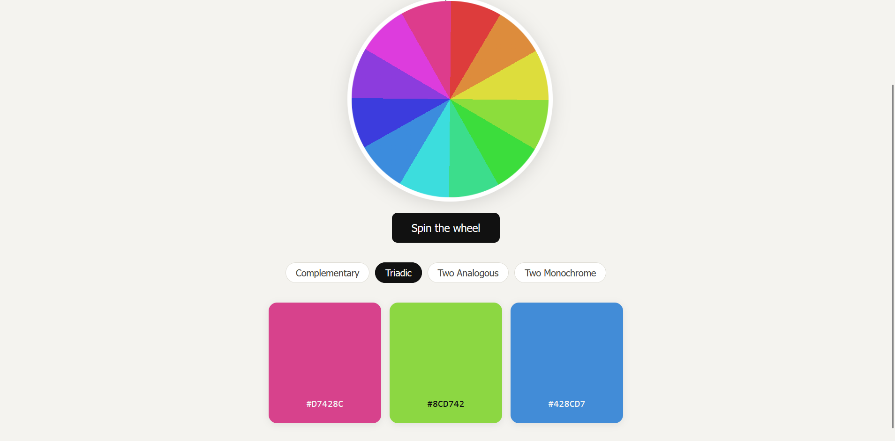
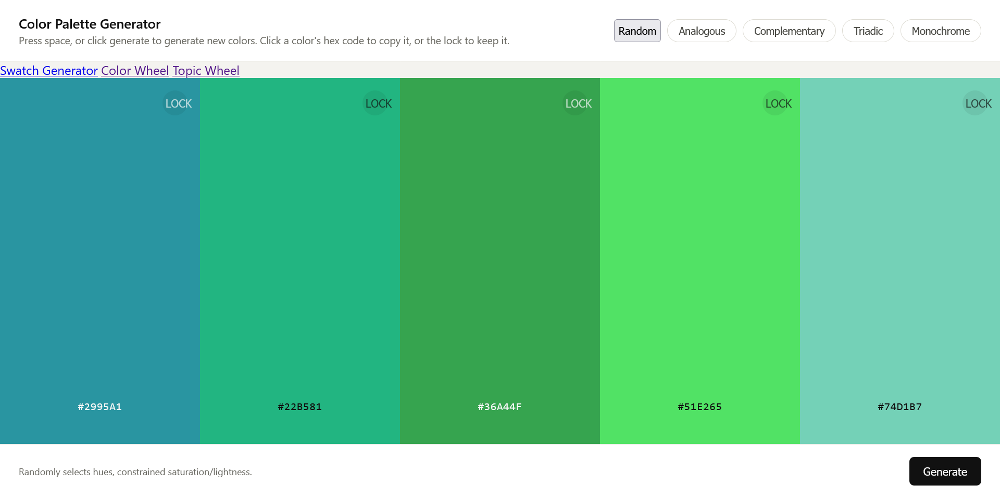
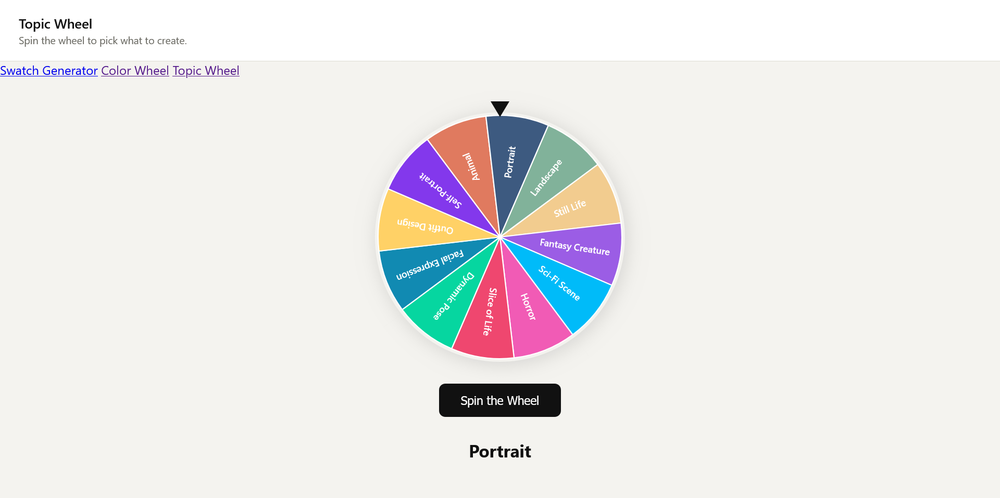

# Color-Palette-Generator-Website

# What the Website Does
My website have three main function.
1. It can generate 5 colors in swatch. There are 5 modes: random, analogous, complementary, triadic, and monochrome.
2. Spin a color wheel. Then it can put that color in one of four swatches: complementary(2 colors), triadic(3 colors), analogous(3 colors), monochrome(3 colors)/
3. Spin a topic wheel that has many topics of which an artist can draw using once of the randomized color palettes. 

# Images

# How it Works
It was made using 3 html files(index.html, wheel.html, topic-wheel.html) for the three webpages. These three pages allow movement between each other. 
All three html files use the same shared css file(style.css)
Finally, there are three js files(script.js, wheel.js, label-wheel.js) that add functionality to each webpage.

# How to Install It

# How to Use It
To use the website, just click on the website linked in the top right corner of this repository. The Website is hosted on vercel allowing for a website that anyone can use.

